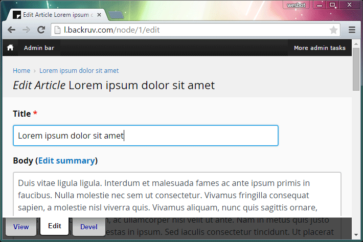
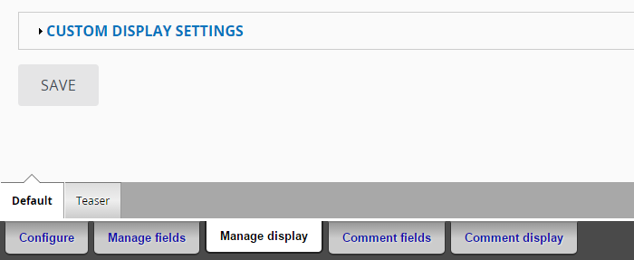

# Sticky Admin Tabs

A simple module that themes Backdrop's admin tabs so they are consistent across themes and in a consistent location, fixed to the bottom of the screen.

The current version is "mobile-friendly" and will be "optimized" in the long run.

No config required, enable it and enjoy! CSS is low specificity and easy to override if different colors/fonts/etc are preferable.

## Screenshots
###Consistent across themes
Treating admin tabs as a global element is great for new users! (takes a little getting used to if you're a long time Backdrop/Drupal user)

### Secondary tab screenshot

## Known issues
If there are more tabs than there is horizontal space they'll disappear from view. This can be an issue with sites that have a lot of view modes, or on really small screens, the current 'disappearing act' is a stop gap so the layout doesn't break. Going to explore some different design solutions to that problem to see what works best. 